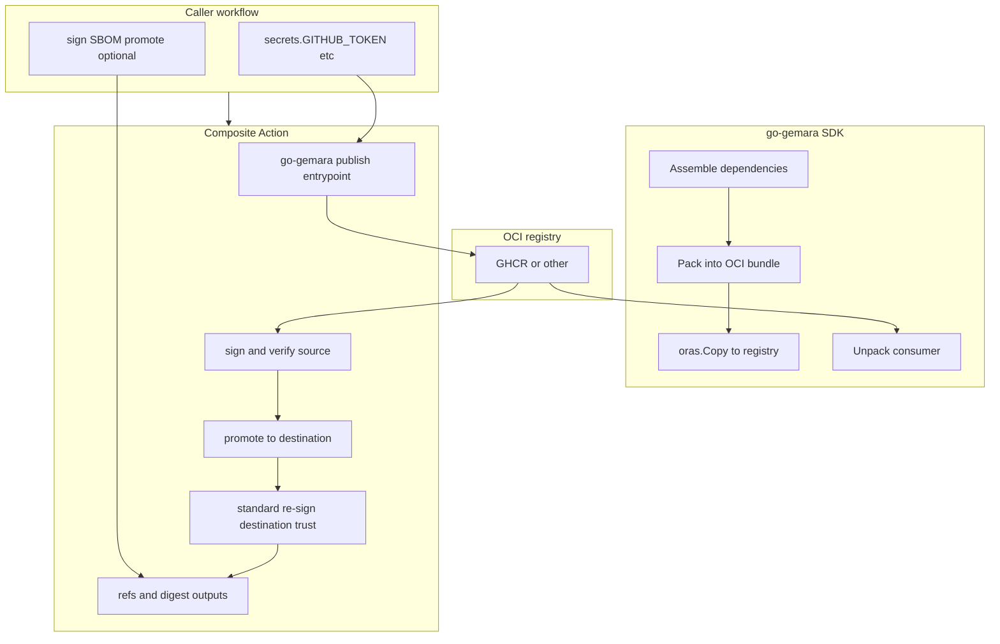

# Design: Gemara Bundle Publish GitHub Action (draft for review)

| Field | Value |
|-------|--------|
| **Status** | Draft — single publish mode via go-gemara SDK implemented in composite action |
| **Primary reviewers** | Gemara / go-gemara maintainers |
| **Related upstream work** | [go-gemara#60 — Standardize Artifact Packaging and Distribution via OCI](https://github.com/gemaraproj/go-gemara/issues/60) |
| **Repository** | `gemaraproj/gemara-registry-cli` on GitHub |

---

## 1. Purpose

This document describes the current split of responsibilities between:

- **[go-gemara](https://github.com/gemaraproj/go-gemara)** (Assemble, Pack, manifest, media types, `oras.Copy` semantics), and
- **this composite action** (publish orchestration: registry auth, sign/verify, optional promote),

so OCI publishing in CI stays aligned with [go-gemara#60](https://github.com/gemaraproj/go-gemara/issues/60)
without duplicating layer-level ORAS descriptor ownership.

It is meant for **maintainer review** before wider adoption (e.g. complytime-policies publish pipelines, shared Actions under `gemaraproj`).

---

## 2. Problem statement (from upstream)

Today Gemara artifacts are produced and distributed in **inconsistent** ways across repositories. [go-gemara#60](https://github.com/gemaraproj/go-gemara/issues/60) proposes **OCI Artifacts** as the standard packaging format, with:

- A clear notion of a **Gemara bundle** in the SDK.
- **`Assemble` / `Pack` / `Unpack`** in the Go SDK.
- **Programmatic resolution** of catalogs (including imports) via **OCI URIs**.
- Optionally, a **standard GitHub Action** to build/publish bundles.

This Action is the candidate for the **last bullet**: it remains **thin** and defers all bundle semantics to the SDK.

---

## 3. Design principles

| Principle | Implication |
|-----------|-------------|
| **SDK is source of truth** | Manifest shape, `artifactType`, layer `mediaType`s, and Pack output are defined and implemented in **go-gemara**, not in this Action. |
| **Transport vs semantics** | Moving bytes and promoting between registries uses ORAS; bundle meaning is still SDK-owned. |
| **No layer assembly in the Action** | The Action does not handcraft layer descriptor tables; all bundle assembly is delegated to go-gemara's `Assemble` + `Pack`. |
| **Pinning** | Callers pin **`@vX.Y.Z`** or commit SHA; ORAS CLI version is an input (`oras_version`). |

### 3.1 Alternatives considered (Options 1 and 2)

These labels align with the **Option 3 thin caller** pattern used in downstream specs (for example
[complytime-policies quickstart](https://github.com/complytime/complytime-policies/blob/main/specs/001-policy-oci-publish/quickstart.md)).

**Option 1: Fully inline caller workflow**

Implement pack, push, sign, and promotion with shell plus CLIs (`oras`, `docker`, `crane`, `cosign`)
directly in each repository workflow, without a reusable composite Action and without org-level
reusable wrappers.

- **Why rejected:** Duplicates transport and trust behavior across repos; difficult to keep aligned
  with [go-gemara#60](https://github.com/gemaraproj/go-gemara/issues/60) and to audit under one
  pinned contract. Matches the same trade-off called out in caller publish research (inline
  `docker run` / ORAS-only paths as non-thin alternatives).

**Option 2: Chained org-infra reusable workflows**

Use `workflow_call` into separate reusable workflows (staging publish, sign or verify, Quay promote)
from **`complytime/org-infra`** or a public mirror, each pinned at its own commit SHA.

- **Why rejected as the default thin-caller shape:** Fits orgs that centralize promotion and
  attestation policy (see [org-infra reusable publish discussion](https://github.com/complytime/org-infra/issues/172)),
  but callers depend on **multiple** workflow pins and on infra release cadence; forks and demos
  need a coherent mirror set. Option 3 concentrates orchestration in **one** pinned composite Action
  while org-infra chains remain valid where governance explicitly requires them.

**Option 3: Single pinned composite Action (this repository)**

One `uses:` reference at a full SHA; encapsulates publish, trust
handling, and optional promotion (architecture below).

---

## 4. High-level architecture (Option 3)

The action uses go-gemara directly: `bundle.Assemble` resolves the dependency tree from a root
Gemara YAML, `bundle.Pack` produces an OCI store, and `oras.Copy` pushes to the target registry.
A vendored Go CLI (`tools/publish/main.go`) wires these SDK calls.

---

## 5. Responsibilities (explicit)

| Component | Owns |
|-----------|------|
| **go-gemara** | `Assemble` / `Pack` / `Unpack`, bundle definition, manifest and media types, **`oras.Copy`** from packed content to registry. |
| **This action** | Build and run the vendored publisher, sign/verify source, optionally promote to destination registry, enforce trust mode, emit source/destination outputs. |
| **Caller workflow** | Checkout, provide inputs/secrets, set release controls and environment gates, and run authoritative cross-registry verification in its own environment. |

---

## 6. Action specification (surface)

Implementation: single composite step in **`action.yml`** (see repository root).

### 6.1 Inputs (summary)

| Input | Role |
|-------|------|
| `registry`, `repository`, `tag` | Target OCI reference (no scheme in `registry`; standard `host` form) |
| `file` | Root Gemara artifact YAML (Policy, Catalog, or Guidance), relative to `working_directory` |
| `validate`, `bundle_version`, `working_directory` | Schema validation toggle, bundle format version, working directory for file resolution |
| `username`, `password` | Registry auth (`password` is required) |
| `oras_version` | ORAS CLI release (digest resolution) |
| `sign_source`, `verify_source` | Source trust controls |
| `promote_to_destination`, `destination_*` | Destination promotion and auth controls |
| `trust_mode`, `sign_destination`, `verify_destination` | Destination trust controls (`resign` is the standard path) |
| `allowed_identity_regex`, `cosign_certificate_oidc_issuer`, `cosign_version` | Signature verification policy and tooling pinning |

### 6.2 Outputs

| Output | Meaning |
|--------|---------|
| `digest` / `source_digest` | Source manifest digest |
| `source_ref` | Source image reference with digest |
| `destination_ref`, `destination_digest` | Destination reference/digest after promotion |
| `verified_source`, `verified_destination` | Verification status booleans |
| `trust_mode` | Effective destination trust mode |

---

## 7. Non-goals (this Action)

- Gemara YAML **validation** (SDK / separate check).
- SLSA/SBOM attestation policy ownership (these remain caller/org standards concerns).
- Defining **canonical `artifactType`** strings — **go-gemara / Gemara** project.

---

## 8. Questions for review (Gemara / SDK)

1. Should `copy-referrers` remain a supported compatibility mode now that re-sign is the standard path?
2. What minimum caller permissions contract should be enforced by policy checks across org repos?

---

## 9. References

- [go-gemara#60](https://github.com/gemaraproj/go-gemara/issues/60)
- [complyctl 001 — research (OCI layout + `oras.Copy`)](https://github.com/complytime/complyctl/blob/main/specs/001-gemara-native-workflow/research.md)
- [complytime-policies — OCI publish spec](https://github.com/complytime/complytime-policies/blob/main/docs/oci-publish-spec.md)
- [org-infra#172 — reusable ORAS publish](https://github.com/complytime/org-infra/issues/172)
- In-repo: [ARCHITECTURE.md](./ARCHITECTURE.md)

---

*Document version: 2.0-draft. Maintainer edits via PR welcome.*
